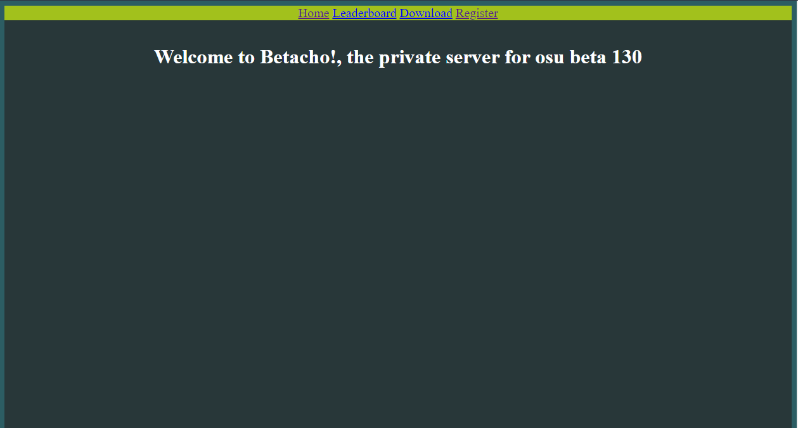
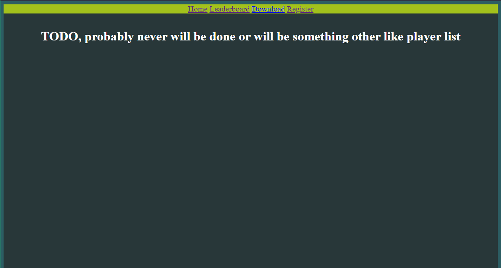
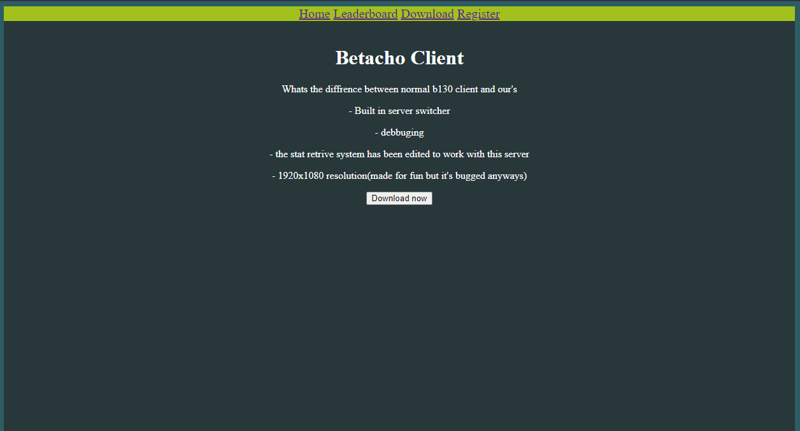
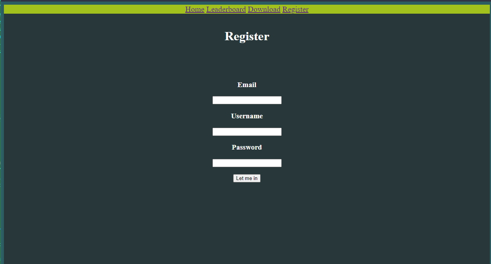
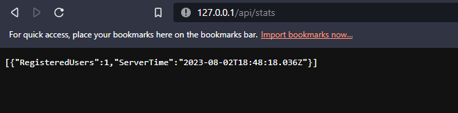
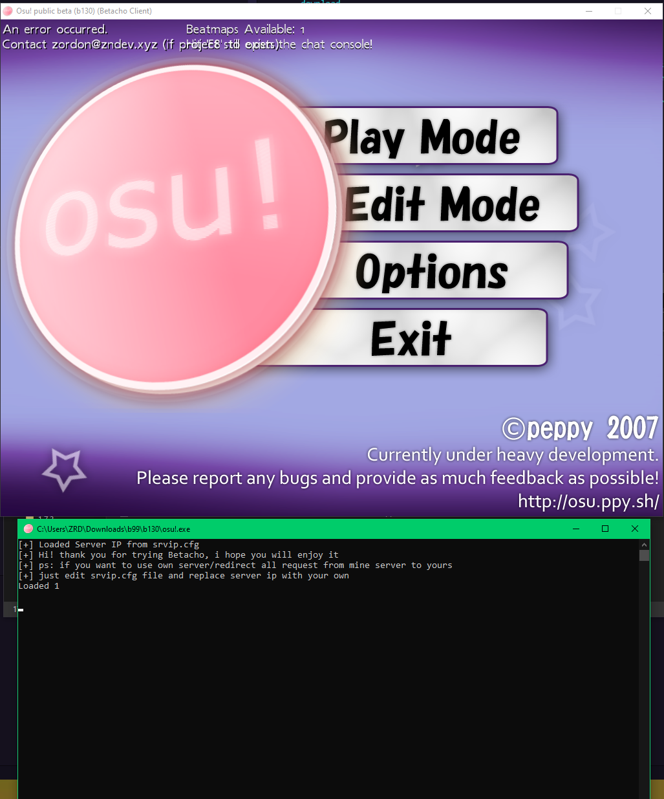
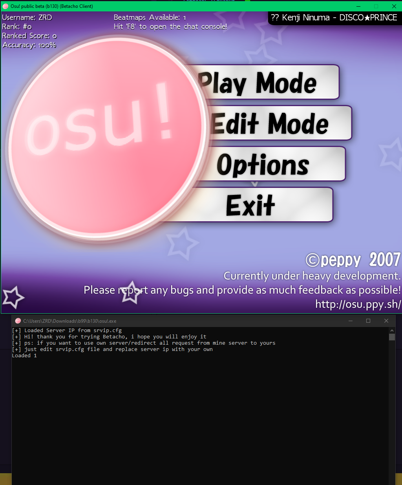

# Betacho - Osu server and modded client for b130
probably first b130 custom bancho

### So i made this project to learn expressjs so the project won't be best and stable but it's not bad overall, i probably won't continue making "regular updates" to this project because i don't see any point espesially i want to move to other beta version
### so enjoy my project src, well there is some(much) things to do in this project mainly handle /web/osu-submit.php which is for submiting score i were trying to do this myself but unfortunately no luck so probably it won't be done. thats i wanted to say good luck using/fixing this src, here is some info under

## endpoints
```
/web/osu-login.php --- thats obvious but i will explain, this is endpoint that osu uses to auth user
if the password and user is correct the server returns "1" but if user of password is wrong then it returns "0"

/web/osu-stat.php --- osu client sends request there to retrive info("Accuracy", "Rank", "Ranked Score"), well i couldn't make it to work on unmodded client so i made my own patch to make it work with my server, it just parses now the data in other way but works the same

/ --- thats obvious also but i will also explain. it returns index.html located in /static/index.html


/home --- does the same this as "/"


/leaderboard --- the name says all, it's need to be done but for now i can't because there is no submit score system


/client --- this is also frontend endpoint that is returning file "static/download.html" which is page with client download

/register --- also frontend endpoint that is returning file for register form(static/register.html)

/api/register --- this is backend endpoint that is being requested after registering first of all it checks if username is taken if yes it returns json message with value "Unfortunately this username is already taken, try finding something other" if not continues now it is making mysql query to database and if everything went successfully you get message with value "Registered sucessfully now you can download client and login :)" if something went wrong you will get message with value "Well, it seems something went wrong. contact admin or idk"

/api/stats --- this endpoint returns json with info about server(current server time and amount of users registered)

```

## TODO
```
done - 🟩
probably done, but it may change: 🟧
half done/bugged - 🟨
not done/ not working - 🟥


handle /web/osu-login.php - 🟩
handle /web/osu-stat.php - 🟧
register frontend - 🟩
register handle - 🟩
score submit handle - 🟥
server stats - 🟨
leaderboard - 🟥
home frontend - 🟩
Client: 🟧
frontend css: 🟧

```

## screenshots: 
Home: 

Leaderboard

Client download

Register

api/stats

Client login Error

Client logged in
